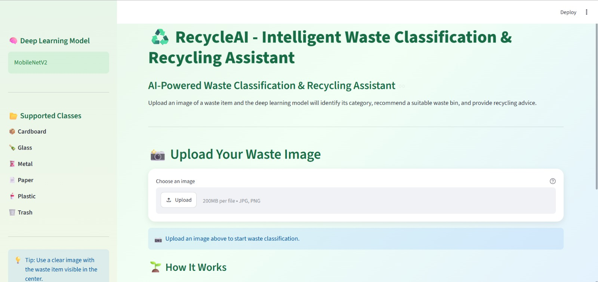
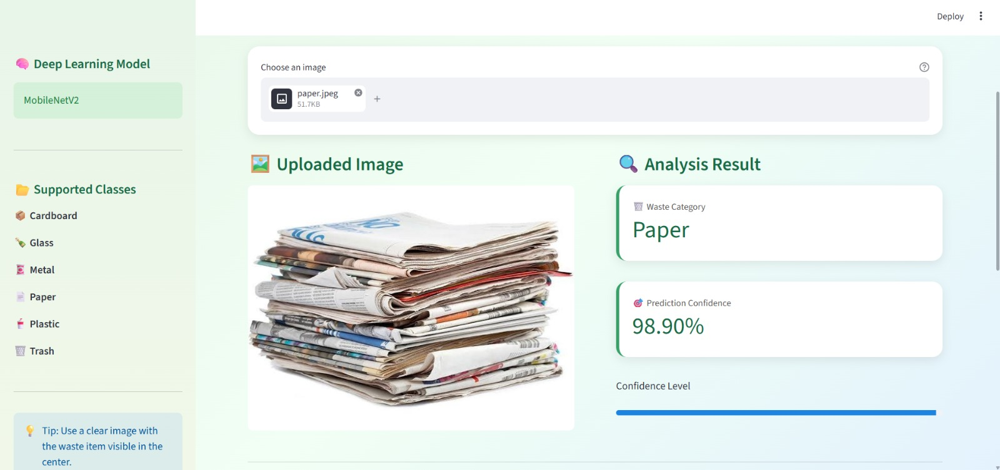
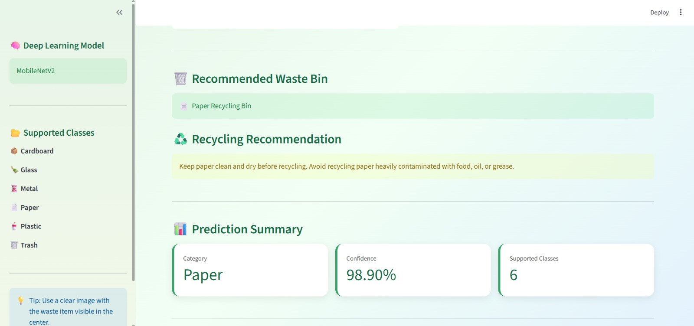

# ♻️ RecycleAI – Intelligent Waste Classification & Recycling Assistant

[](https://www.python.org/)
[](https://www.tensorflow.org/)
[](https://keras.io/)
[](https://streamlit.io/)
[](LICENSE)

## 📖 Overview

**RecycleAI** is an intelligent waste classification and recycling assistant powered by **Deep Learning and Computer Vision**.

The system uses **MobileNetV2 Transfer Learning** to classify uploaded waste images into six categories:

- 📦 Cardboard
- 🍾 Glass
- 🥫 Metal
- 📄 Paper
- ♻️ Plastic
- 🗑️ Trash

In addition to classifying the waste, RecycleAI provides a **prediction confidence score**, recommends a suitable **waste bin**, and gives practical **recycling/disposal guidance**.

The application is built using **Streamlit**, providing an interactive and user-friendly web interface for real-time image classification.

---

## ✨ Key Features

### 🤖 AI-Based Waste Classification

Uses a trained **MobileNetV2 deep learning model** to recognize different types of waste from images.

### 📸 Image-Based Prediction

Users can upload:

- JPG
- JPEG
- PNG

images through the Streamlit interface.

### 🎯 Prediction Confidence

The application displays the model's prediction confidence for the detected waste category.

### 🗑️ Waste Bin Recommendation

Based on the predicted category, the application recommends a suitable waste bin.

Example:

```text
Plastic    → Plastic / Recyclable Waste Bin
Glass      → Glass Recycling Bin
Metal      → Metal Recycling Bin
Paper      → Paper Recycling Bin
Cardboard  → Cardboard Recycling Bin
Trash      → General Waste / Landfill Bin
```

### ♻️ Recycling Guidance

Provides category-specific recommendations for proper recycling and disposal.

### 🎨 Interactive Web Interface

A colorful and responsive Streamlit interface makes the application easy to use.

### ⚡ Fast Image Inference

The trained model is designed for quick prediction after an image is uploaded.

---

## 🧠 Machine Learning Approach

RecycleAI uses **Transfer Learning** with MobileNetV2.

Instead of training a convolutional neural network completely from scratch, the project uses a MobileNetV2 model pretrained on **ImageNet** and adapts it for waste classification.

### Model Architecture

```text
                 Input Image
                     │
                     ▼
               224 × 224 × 3
                     │
                     ▼
              MobileNetV2
          Pretrained on ImageNet
                     │
                     ▼
       Global Average Pooling
                     │
                     ▼
             Dense Layer
             128 neurons
                 ReLU
                     │
                     ▼
                Dropout
                  0.5
                     │
                     ▼
             Output Layer
            6 Classes
               Softmax
                     │
                     ▼
          Predicted Waste Class
```

---

## 📊 Waste Categories

| Category | Examples |
|---|---|
| 📦 Cardboard | Boxes, cartons, packaging |
| 🍾 Glass | Bottles, jars, glass containers |
| 🥫 Metal | Cans, aluminum and metal objects |
| 📄 Paper | Newspapers, magazines, office paper |
| ♻️ Plastic | Bottles, containers, plastic packaging |
| 🗑️ Trash | General non-recyclable waste |

---

## 🗄️ Dataset

The project uses the **TrashNet dataset** for waste image classification.

**Dataset repository:**  
https://github.com/garythung/trashnet

The dataset contains approximately **2,527 images across six waste categories**.

### Image Preprocessing

The images are processed before being passed to the model.

The preprocessing pipeline includes:

- Image resizing to **224 × 224 pixels**
- RGB image conversion
- **MobileNetV2 preprocessing**
- Data augmentation during training

## 🏋️ Training Configuration

| Parameter | Configuration |
|---|---|
| Model | MobileNetV2 |
| Learning Approach | Transfer Learning |
| Input Size | 224 × 224 × 3 |
| Optimizer | Adam |
| Loss Function | Categorical Cross-Entropy |
| Output Activation | Softmax |
| Batch Size | 32 |
| Classes | 6 |
| Early Stopping | Yes |
| Learning Rate Scheduling | ReduceLROnPlateau |

---

## 📈 Model Performance

The trained model documentation reports approximately:

- **Training Accuracy:** ~95%
- **Validation Accuracy:** ~92%
- **Model Size:** ~14 MB
- **Inference Time:** <100 ms per image

> **Note:** Actual performance can vary depending on the image, environment, and deployment configuration.

---

## 🖥️ Application Workflow

```text
User uploads image
        │
        ▼
Image preprocessing
        │
        ▼
MobileNetV2 model
        │
        ▼
Waste classification
        │
        ├───────────────┐
        │               │
        ▼               ▼
Confidence Score   Waste Category
                        │
                        ▼
                Recommended Bin
                        │
                        ▼
              Recycling Guidance
```

## 🗂️ Project Structure

```text
RecycleAI/
│
├── app.py
├── best_model.keras
├── requirements.txt
├── README.md
├── .gitignore
├── LICENSE
│
├── screenshots/
│   ├── home.png
│   ├── prediction.png
│   └── recycling.png
│
└── notebooks/
    └── TrashNet.ipynb
```

# 🚀 Installation

## Prerequisites

Make sure the following are installed:

- Python 3.8+
- pip
- Git

---

## 1️⃣ Clone the Repository

```bash
git clone https://github.com/YOUR_USERNAME/RecycleAI.git
```

Move into the project directory:

```bash
cd RecycleAI
```

---

## 2️⃣ Create a Virtual Environment

```bash
python -m venv venv
```

### Windows

```powershell
.\venv\Scripts\Activate.ps1
```

### macOS / Linux

```bash
source venv/bin/activate
```

---

## 3️⃣ Install Dependencies

```bash
pip install -r requirements.txt
```

---

## 4️⃣ Run the Application

```bash
streamlit run app.py
```

The application will open in your browser.

Default address:

```text
http://localhost:8501
```

---

# ☁️ Streamlit Deployment

RecycleAI can be deployed using **Streamlit Community Cloud**.

## Deployment Steps

1. Push the project to GitHub.
2. Open Streamlit Community Cloud.
3. Connect your GitHub account.
4. Select the RecycleAI repository.
5. Select the `main` branch.
6. Select `app.py` as the main file.
7. Click **Deploy**.

Streamlit will install the dependencies from:

```text
requirements.txt
```

and launch the application.

---

# 🗑️ Waste Bin Recommendation

RecycleAI provides a recommended waste bin based on the predicted category.

| Predicted Category | Recommended Bin |
|---|---|
| 📦 Cardboard | Paper / Cardboard Recycling Bin |
| 🍾 Glass | Glass Recycling Bin |
| 🥫 Metal | Metal Recycling Bin |
| 📄 Paper | Paper Recycling Bin |
| ♻️ Plastic | Plastic / Recyclable Waste Bin |
| 🗑️ Trash | General Waste Bin |

> **Important:** Waste-bin categories and colors can differ between cities and municipalities. The recommendations should be adapted according to local waste-management rules for real-world deployment.

---

# 📸 Application Screenshots

## 🏠 Home Page



## 🔍 Classification Result



## ♻️ Recycling Recommendation



---

# 🛠️ Technologies Used

### Programming Language

- Python

### Deep Learning

- TensorFlow
- Keras
- MobileNetV2

### Data Processing

- NumPy
- Pillow

### Web Application

- Streamlit

### Development & Experimentation

- Jupyter Notebook
- Git
- GitHub

---

# 👤 Author

**Sayani Jana**

**M.Tech – Data Science**

**National Institute of Technology, Silchar**
